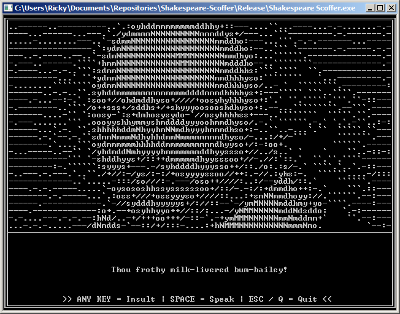

# Shakespeare-Scoffer
If you are going to insult someone at least use class, and a command line interface.

## Inctroduction
This is a remake of an original project I made during my time at Year Up in 2012. I since lost the source code to the project (and many others). I had some free time from my job so I decided to remake it. The program randomly generates insults by picking from three different lists of Shakespearean insults and then uses Microsoft's SAPI for text-to-speech to speak the insults the the user. This is supposed to be a joke app. Have fun.

## How to build
This project uses Microsoft's SAPI so it will only work for Windows, unless in the future I port it over to Linux. Shouldn't be too hard if I can find a similar Linux based TTS library.

To build the example program on Windows with Visual Studio open a `Developer Command Prompt` and enter this:

Change your directory to the source directory
>cd C:/path/to/source

Compile and link the source code
>cl /I ../extlibs/PDCurses/include ../extlibs/PDCurses/lib/pdcurses.lib Scoffer.cpp

The code should compile and produce GreenThumb.exe.

If you are using MinGW open a `Command Prompt` and enter this:

Setup your path variable
>path=C:/path/to/MinGW/bin

Change your directory to the source directory
>cd C:/path/to/source

Compile and link the source code
>mingw32-make

## How to use
Press any key to generate a new insult. Press Space to repeat insult. Press Q or Escape to quit the program.
